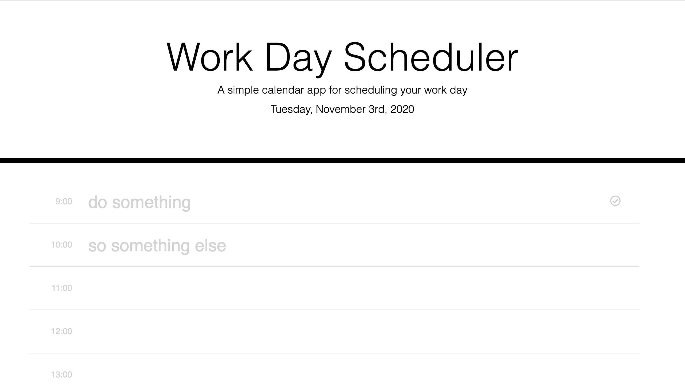

# Work-Day-Scheduler
A simple calendar app for scheduling your work day.

## Table of Contents
1. [ Description ](#desc)
2. [ Visuals ](#visuals)
3. [ Deployed Webpage ](#deployed)
4. [ Support ](#support)
5. [ Next Steps ](#next_steps)
6. [ Authors and Acknowledgement ](#acknowledge)
7. [ License ](#license)

## 1. Description
This is a very basic planner that you can use to plan your day.

#### Note:
I changed the look of the planner, because I didn't like the original styling.

### Summary of Functionality

* You can store agenda items into the planner by either cloicking on the checkmark, or by pressing enter after you are done typing in the text field.
* the style of each time slot is updated depending on whether the event is in the past, present or future.

## 2. Visuals
Screenshot of the webpage, clearly I was not working on this during regular work hours.

## 3. Deployed Webpage
[The deployed site](https://tasha876.github.io/Work-Day-Scheduler/index.html), hosted by GitHub Pages.

## 4. Support
Should you find an issue with this webpage, please create a [new issue](https://github.com/Tasha876/Work-Day-Scheduler/issues/new/choose) on my GitHub repository.

## 5. Next steps
This is a very basic planner and several features could be added, some of these include (but are in no way limited to):
- the ability to add items that are either less than or more than 1 hour
- the ability to add descriptions to each event
- the ability to add to more than one day
- the ability to add events to hours outside of the workday, but still have the next set of workday hours be on focus when the planner is first opened
- better UI possibly including a datk mode

## 6. Authors and Acknowledgement
This site was created entirely by Natasha Fray using the [jQuery](https://jquery.com/).

## 7. License
This project is covered by the [MIT](LICENSE) license.

